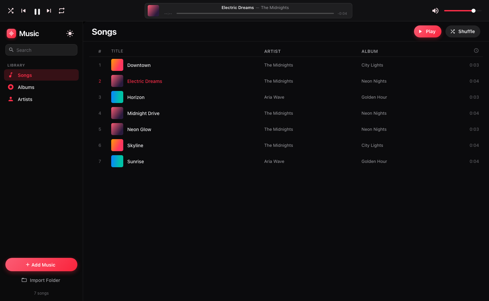

# Music — an Apple Music–style local player

A desktop-style music player built with **Angular 22** and **Angular Material
(M3)**, restyled to match the **Apple Music** design language. Import audio
files straight from your computer and play them — everything runs locally in
the browser; no accounts, no uploads.



## Features

- **Import local files** — click _Add Music_, _Import Folder_, or just
  **drag & drop** audio files anywhere on the window.
- **Metadata + cover art** — ID3 / Vorbis / MP4 tags are parsed with
  [`music-metadata`](https://github.com/borewit/music-metadata) (title, artist,
  album, track no., year) and embedded artwork is extracted.
- **Library views** — Songs (sortable table), Albums (grid), Artists, and a
  per-album detail page, all grouped automatically from tags.
- **Full playback** — play/pause, next/previous, seek (drag the scrubber),
  volume, mute, **shuffle**, and **repeat** (off / all / one).
- **Apple design system** — SF Pro system font, the Apple Music red accent,
  frosted/vibrancy surfaces, the top-bar "LCD" now-playing display, and a
  **dark-by-default** theme with a light/dark toggle.
- **Modern Angular** — standalone components, **signals** everywhere,
  `@if`/`@for` control flow, `OnPush`, **zoneless** change detection.

## How Material is themed like Apple

The Material 3 theme is configured in `src/styles.scss` via `mat.theme(...)`,
then bent toward Apple's look using the supported token surfaces:

- `mat.theme-overrides(...)` forces Material's `primary` to the Apple Music red.
- `mat.slider-overrides(...)` gives the scrubber/volume a thin track + small
  handle.
- `mat.button-overrides(...)` makes buttons pill-shaped.
- A set of `--apple-*` and surface custom properties (driven by the CSS
  `light-dark()` function + `color-scheme`) keep every custom component
  theme-aware in both modes.

## Prerequisites

- **Node.js ≥ 24.15** (or ≥ 22.22, or ≥ 26) — required by Angular CLI 22.
- npm 10+

## Getting started

```bash
npm install
npm start          # ng serve → http://localhost:4200
```

Open `http://localhost:4200`, then add some songs from your machine.

## Scripts

```bash
npm start      # dev server with live reload
npm run build  # production build → dist/ngmusic
npm test       # unit tests (Vitest)
```

## Tech stack

Angular 22 · Angular Material + CDK (M3) · TypeScript · SCSS ·
music-metadata · HTML5 Audio API · Vitest.

## Notes

- Everything is client-side: imported files never leave your machine. Object
  URLs are created for playback and cover art, and revoked when the library is
  cleared.
- The library is in-memory for the session — re-import after a refresh. (Adding
  IndexedDB persistence with the File System Access API would be a natural next
  step.)
